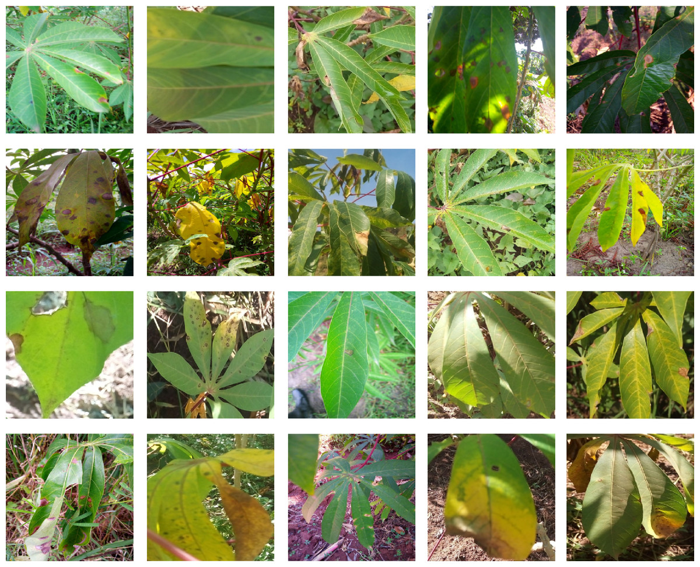

# Cassava Leaf Disease Classification

## Overview

Crop disease classification is a critical challenge in agriculture, involving the accurate identification and categorization of various plant diseases based on visual symptoms. This process is crucial for effective crop management, as early and precise disease detection can significantly improve crop yields and reduce economic losses for farmers.

Traditional methods of crop disease classification rely heavily on expert knowledge and visual inspection, which can be time-consuming, subjective, and prone to errors. Even trained agricultural experts may struggle to diagnose diseases correctly, especially when symptoms are subtle or similar across different diseases. This has led to an increasing interest in automated solutions using advanced technologies such as machine learning and computer vision.

In recent years, deep learning techniques have shown promising results in crop disease classification. These methods can automatically extract relevant features from plant images and learn to distinguish between different disease categories with high accuracy. Various deep learning models, including convolutional neural networks (CNNs) like ResNet, DenseNet, and EfficientNet, have been applied to this problem with considerable success.

In this context, we focus on the cassava plant (Manihot esculenta), a crucial staple crop in many tropical and subtropical regions. Cassava is particularly important in Africa, where it serves as a primary source of carbohydrates for millions of people. However, cassava is susceptible to several diseases that can significantly impact its yield and quality.



## Data

The dataset used in this project is sourced from the [Cassava Leaf Disease Classification](https://www.kaggle.com/competitions/cassava-leaf-disease-classification/data) on Kaggle. The dataset consists of images of cassava leaves, each labeled with one of the following disease categories:

*   Cassava Bacterial Blight (CBB)
*   Cassava Brown Streak Disease (CBSD)
*   Cassava Green Mottle (CGM)
*   Cassava Mosaic Disease (CMD)
*   Healthy

The dataset is divided into training and testing sets. The training set is used to train the classification model, while the testing set is used to evaluate its performance.

## Project Structure
```
Crop_Disease_Classifier/
├── image/
│ ├── Cassava.jpg
|
├── notebooks/
│ ├── exploratory_analysis.ipynb
│ ├── result_visualization.ipynb
|
├── src/
│ ├── data_preprocessing.py
│ ├── model.py
│ ├── train.py
│ ├── utils.py
│
├── tests/
│ ├── test.py
│
├── README.md
├── main.py
├── requirements.txt 
```
## Model Architecture

The model used in this project is based on the ResNet50 architecture, which is a deep convolutional neural network known for its excellent performance in image classification tasks. The architecture includes:

1. A pre-trained ResNet50 base model (with weights from ImageNet)
2. Custom fully connected layers added on top of the base model:
   - A dense layer with 256 units and ReLU activation
   - A dropout layer with a rate of 0.5 for regularization
   - A final dense layer with 5 units (corresponding to the 5 disease categories) and softmax activation

## Callbacks

The training process incorporates several callbacks to improve model performance and training efficiency:

1. Early Stopping: Monitors validation loss and stops training if no improvement is seen for a specified number of epochs.
2. Model Checkpointing: Saves the best model based on validation loss.
3. Learning Rate Scheduler: Adjusts the learning rate during training using a step decay approach.

## Dependencies

The project dependencies are listed in the `requirements.txt` file. To install the dependencies, run the following command:

```
pip install -r requirements.txt
```

## Usage

To train the model, run the `main.py` script with the desired arguments:

```
python main.py --data_dir <path_to_data> --epochs <number_of_epochs> --batch_size <batch_size> --learning_rate <learning_rate>
```


## Results

The result_visualization.ipynb notebook provides a comprehensive overview of the model's performance. This notebook includes:

1. Visualization of training results using the original imbalanced dataset
2. Visualization of training results using a balanced dataset (achieved through undersampling)

Key metrics visualized include:
- Training and validation accuracy over epochs
- Training and validation loss over epochs
- Learning Rate Analysis
- Confusion matrix for the best performing model

## Future Work

1. Experiment with other pre-trained models such as EfficientNet or Vision Transformer (ViT) for potentially improved performance.
2. Implement data augmentation techniques to increase the diversity of the training set and potentially improve model generalization.
3. Explore ensemble methods, combining predictions from multiple models to enhance overall accuracy.
4. Develop a user-friendly web or mobile application for easy deployment and use by farmers in the field.
5. Implement a continuous learning pipeline to periodically retrain the model with new data, ensuring its relevance over time.

## License

This project is licensed under the MIT License. Please review the LICENSE file for more details.